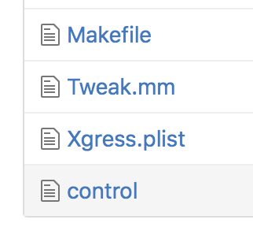
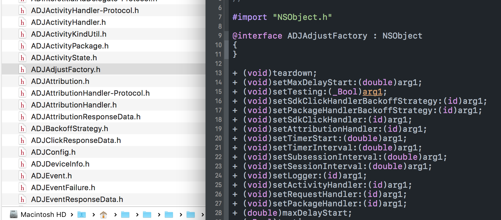
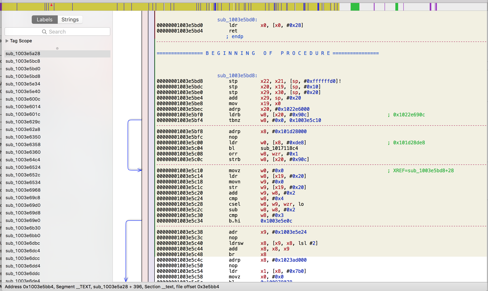
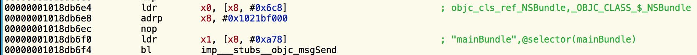
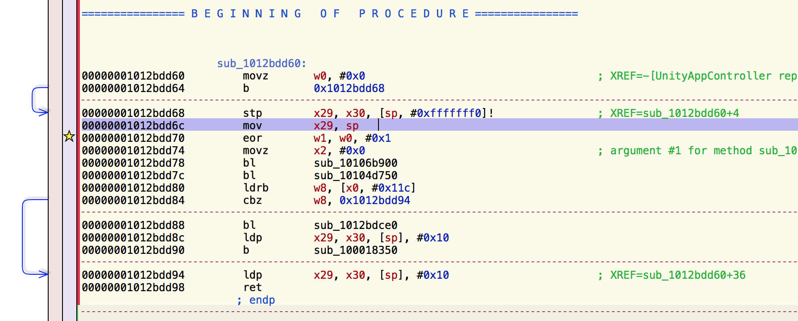
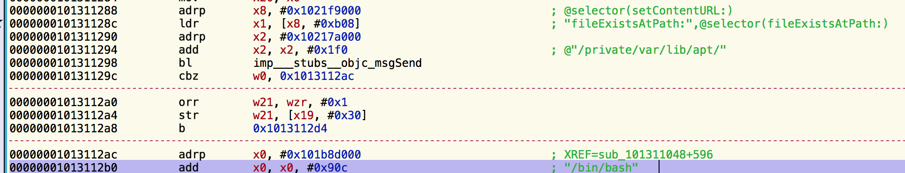

# Run Mario！写一个越狱插件

## 摘要

本文记叙了制作一个越狱插件的过程，它可以解除 SuperMarioRun 在越狱手机上的限制。（SuperMarioRun 是任天堂在 iOS 平台上推出的一款游戏）。插件可以通过 Cydia 安装（搜索 RunMario）。

## 故事

春节假期玩了很久的 SuperMarioRun，当得到了前三关的全部九个金币后，终于下决心买了后面的世界，玩得津津有味。

前几日发现 iOS 10.2 可以越狱了，作为一个开发者，迫不及待地越狱了自己的手机。越狱后打开 Mario，竟然发现了启动闪退（启动画面之后就立刻退出了）。不禁职业性地感叹，作为一个大厂，产品就这个质量？？


重试了几次，稳定复现，怀疑和刚才的越狱有关。google 一下，发现是游戏本身做的限制。可以断定为为了防止在越狱手机上作弊，而主动做出的限制，Ingress、PokemanGo 都有同样的机制（但起码人家是提示有问题，而不是像 crash 一样的表现）。

搜索得知使用 tsProtector 可以使 App 的越狱检查失效，可以继续玩。但因为 iOS 10 的越狱刚出，很多软件还没有适配，而且 tsProtector 是收费软件（免费试用一个），就决定自己写一个，反正也不复杂 (｡･ω･)ﾉﾞ。

## 原理

在 Jailbreak dev 的概念里，这样的一个插件称为 tweak，其单词原意为「微调」。tweak 的实现依赖于 Cydia Substrate，它提供了运行时注入的功能。它在 app 启动的时候，把插件作为动态库加载到内存里，插件使用 Substrate 提供的 API，使用类似于 OC 运行时动态替换方法的形式，修改某些函数实现，以实现修改功能。更多内容可以参考「iOS 应用逆向工程」 这本书，以及 [iPhoneDevWiki](http://iphonedevwiki.net)。

App 检测越狱环境的方式有很多，其基本原理是做一些在越狱之前不能做的事情，如果能做成功，则是越狱状态。最常见的方式是检测一些在越狱之前不可以访问的路径，以及一些越狱后常见的文件（比如 cydia.app）。或者检测 `/etc/fstab` 的大小、system(0) 等。[这里](https://github.com/Shmoopi/iOS-System-Services/blob/master/System%20Services/Utilities/SSJailbreakCheck.m) 提供了一些检测方式。

为了使 App 的检测失效，我们可以找到 App 中检测越狱的函数，直接返回 NO，或者 hook 上面几种方法中涉及到的函数，使其失效即可。

## 过程

### 尝试一

[Xgress](https://github.com/Qusic/Xgress) 是为 ingress 是提供逃脱越狱检查的 tweak，开源项目。那我就参照它开始写吧。

这个项目非常简单， 文件如下:



其中 `plist` 文件负责指定插件生效的 app 的 bundle ID，`control` 是存储名称作者等信息，`makefile` 配置编译参数，真正的代码只有一个文件 `Tweak.mm` 。它的核心内容也非常简单，最主要的内容就是一句话:

```c++
MSHookFunction((FILE **)MSFindSymbol(NULL, "_fopen"), (FILE **)optimized_fopen, (FILE ***)&original_fopen);
```

它把 `fopen` 函数的实现替换为自己的一个实现 `optimized_fopen`，后者检测了文件路径是否是某几个路径，如果是则是在进行越狱检测，替换成一个其他的路径，否则执行原函数内容。

```
static FILE *optimized_fopen(const char *filename, const char *mode) {
    if (!allowAccess([NSString stringWithUTF8String:filename])) {
        filename = "";
    }
    return original_fopen(filename, mode);
}
```

很好很直接 (´･ω･｀) 。我把生效的 bundle ID 改成 Mario 的 com.nintendo.zara ，通过 [THEOS](https://github.com/theos/theos) 编译 （这里的作用相当于 xcode）

```shell
make package install 
```

（通过 `make package` 就可以生成 .deb 包，如果配置好 ssh 就可以直接通过 `install` 安装到手机上，也可以手动通过 传到手机里，通过 iFile 等工具来安装。）

打开 Mario，然而又闪退了（它退出的方式真的很像闪退，后文会用闪退代指检测越狱环境后主动退出）。

打开 Ingress，插件生效，看来安装没有问题。Xgress 里只对 fopen 等几个函数做了 hook，但对于 NSFileManager 里的方法并没有处理。而后添加了对几乎所有NSFileManager (NSString NSData) 里有关路径的函数的 hook。

make package install ！！！！然而，还是闪退。事情果然没有这么简单。

### 尝试二

仔细读了一下上文中提到的检测越狱环境里的函数，检测了十几项，依次 hook 看起来比较麻烦 ，换个思路 : 去找 App 里调用的地方，比如 `-(void)isJailbreak;` 这样的函数。

大概的思路是这样的，找到 App 的 binary，导到电脑上 dump 出头文件，然后找相应的函数名。

越狱手机上安装 Clutch（它是一个命令行工具），它是用来「砸壳」的，因为 appstore app 都是经过加密的，否则不能 dump。app binary 存放在 `/var/containers/Bundle/Application` 下 （Mario 的 app 叫 rb\_02\_04 … app, 不知道为什么，因为里面的 binary 叫 Super Mario Run 我才认出来的），在手机上使用 Clutch 对 binary 文件进行处理 （这里需要 root 权限，开始试了几次都提示 segment fault）。把解密后的 Binary 考到电脑里，使用 classdump 工具生成头文件。



通过很简单的方式，OC 的类名、继承关系、函数名全都生成出来了。 从这个角度看，OC 真是什么隐私都没有呀 ╮(╯▽╰)╭ 。

在这里文件里，尝试搜索 jailbreak、sandbox 等字段，找到了 `FIRInstanceID` 下的 `- (_Bool)isSandboxApp;` 感觉很像，编辑 hook 代码:

```objective-c
%hook FIRInstanceID
+ (void)load {
  NSLog(@"GAO: I'm in"); // 为了确认 hook 生效
  %orig;
}
- (_Bool)isSandboxApp {
  NSLog(@"GAO: hooked isSandbox");
  return NO;
}
%end
```

make package install ！！！打开 Mario，继续闪退。通过 Xcode - Device 可以看到系统 log，hook 生效，但是 `isSandboxApp` 并没有被调用。失败。同时找了其他几个可疑的函数，都没有被调用。

既然光看头文件找不到，那不要怪我放大招了 :  反 汇 编！

把 binary 拖进 Hopper Disassembler 里，



一脸懵逼。。。


尝试搜索 isSandboxApp 那个函数，找到了实现，但并不能向上找到调用的地方。既然不擅长看汇编，有没有什么方式可以找到一些提示呢？

想起了 crash log 中的函数调用栈，可是展示出函数的调用关系。虽然对于一个陌生 App，我们得到的 crash log 中是未解析的 file offset，但这个值正好可以在反汇编中定位内容。

看了一下 device crash log，虽然表现得样子像闪退，但实际上并没有 crash log。在 console 里打印出的实时 log 中，发现了这样一条: （iOS 10 下）

```
iPhone SpringBoard[1672] <Notice>: Process exited: <FBApplicationProcess: 0x10be76ac0; Super Mario Run; pid: -1> -> <FBApplicationProcessExitContext: 0x174852c00; exitReason: voluntary; terminationReason: (none)>
```

`exitReason: voluntary` ，难道程序自己调用了 `exit(0)` ? 那我们就 hook 一下 `exit() ` ，作为切入点。

```objective-c
void exit(int);
%hookf(void, exit, int code) {
  NSLog(@"GAO: we're hooking exit");
  NSLog(@"%@",[NSThread callStackSymbols]);  // 这句可以得到和 crash log 一样的调用栈展示
  return;
}
```

安装插件，打开 Mario，打印出这样的 log，

```
02:37:15 iPhone Super Mario Run(runmario.dylib)[17507] <Notice>: GAO: we're hooking exit
02:37:15 iPhone Super Mario Run(runmario.dylib)[17507] <Notice>: (
	0   runmario.dylib                      0x0000000102ad6c70 _ZL31_logos_function$_ungrouped$exiti + 48
	1   Super Mario Run                     0x0000000100114474 Super Mario Run + 99444
	2   Super Mario Run                     0x0000000100106d94 Super Mario Run + 44436
	3   Super Mario Run                     0x0000000100106bd4 Super Mario Run + 43988
	4   QuartzCore                          0x000000018dfeef24 <redacted> + 44
    ...
```

（注: 这是 mario 1.1.1 版本时的输出，我在写插件的时候还是 1.1，打印的 file offset 是不一样的）

所以这三个 `99444` `44436` `43988`， 这三个 file offset 就是 mario app 在检测到越狱环境，而直接调用 exit 退出的调用过程。这三个所代表的函数中必然有一个做了越狱检测。

通过 Hopper 的 `Go to file offset` 功能，我们找到了这三个函数的实现。OC 的函数调用，在汇编下还是很好认的，以为 OC 的方法调用，其实最终就是 `msg_send` 函数的调用。方法（selector）作为字符串类型的参数， 可以直接在反汇编中给出注释。而且函数调用中使用 X0 X1 X2 等寄存器作为参数的存放，其每个寄存器存什么都是有固定套路的 （`[X0 X1: X2 foo:X3 bar:stack...]`）。下图是个简单的例子。很明显它调用了 `[NSBundle mainBundle]`。



然而在我找出来的这三个过程里，确实一片茫茫汇编海洋，没有一个 OC 的函数，都是使用类似 `bl` 的汇编跳转指令直接跳转地址。只有最上层的显示是一个 OC 函数，[UnityAppController repaint]。游戏应该是用 Unity 做的，repaint 很明显是一个与显示有关的函数，hook 它为空函数。打开 App 后的确没闪退，但是也什么都没有显示。

仔细看了这几个调用过程里，发现了一段代码感觉很像:



很明显，1012bdd84 那行是个 if 判断，一个分支是走到了 1012bdd90 那行，跟进去地区找到了 exit 函数的调用，算是检测到越狱环境退出，而另一个分支则继续运行。这个 procedure 这么短，明显不是真正检测函数所在，而这里面的 1012bdd78 和 1012bdd7c 两个 `bl` 一定就是真正判断的函数。

然而跟下去又是一片茫茫汇编海洋。没有函数名，就没有办法 hook 更改，无能为力。即使我们知道 if 判断就在这个地址，也是不能直接改 binary 的 （代码签名通不过）。无奈，谁叫游戏都用 c++ 写的呢 ╮(╯▽╰)╭ 

看了很久汇编，没有进展，有些灰心。

### 柳暗花明

对封堵检测越狱的函数，又添加的了几种新的方式，然而没有效果。

在汇编中搜索 `"/bin/bash"`这样的字符串，试图找找到调用的地方，而这个调用一定是越狱检查的函数。真的有这样的字符串（似乎 1.1.1 版本里已经没了），该字符串调用的地方只有一处，着一定是我们要找的函数了。然而，还是没有函数名给我们 hook。但这里明显出现了 `fileExistsAtPath:` 这样敏感的函数。



对这个函数 hook 过呀？难道封堵的路径还不全？打印出来看看

```objective-c
%hook NSFileManager
- (BOOL)fileExistsAtPath:(NSString *)path {
  if(!allowAccess(path)){
     return NO;
  }
  if (![path hasPrefix:@"/var/mobile/Containers/Data/Application/"]&&   // app data
      ![path hasPrefix:@"/var/containers/Bundle/Application"]) {        // app binary
     %log(@"GAO_ignored",path);
  }
  return %orig;
}
```

真的有输出结果，补全漏掉的路径，make package install !!

It works!

Finally~

最后的代码，可以在 [github](https://github.com/leavez/RunMario) 上找到。

## 后续

最后还需要提交到 Cydia。

使用 `make package FINALPACKAGE=1` build 一个 release 版的 deb 包。Control 文件里的一些信息就是要在 cydia 里展示的，要好好填写。

BigBoss 是 Cydia 的默认源之一，并且可以免费提供 host。在 [这里](http://thebigboss.org/hosting-repository-cydia) 进行简单的填写上传包即可。等待一两天就可以上架看到了。

